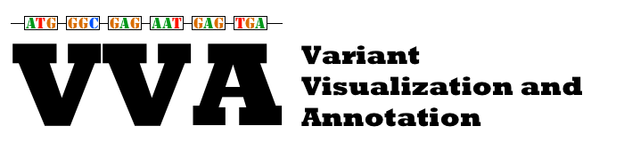
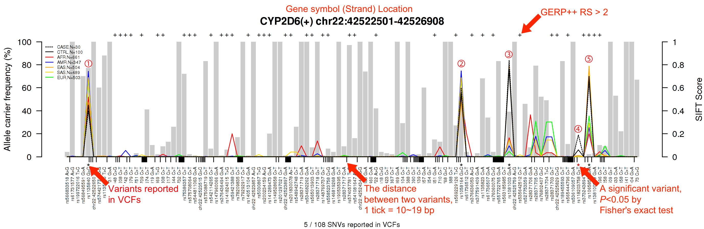
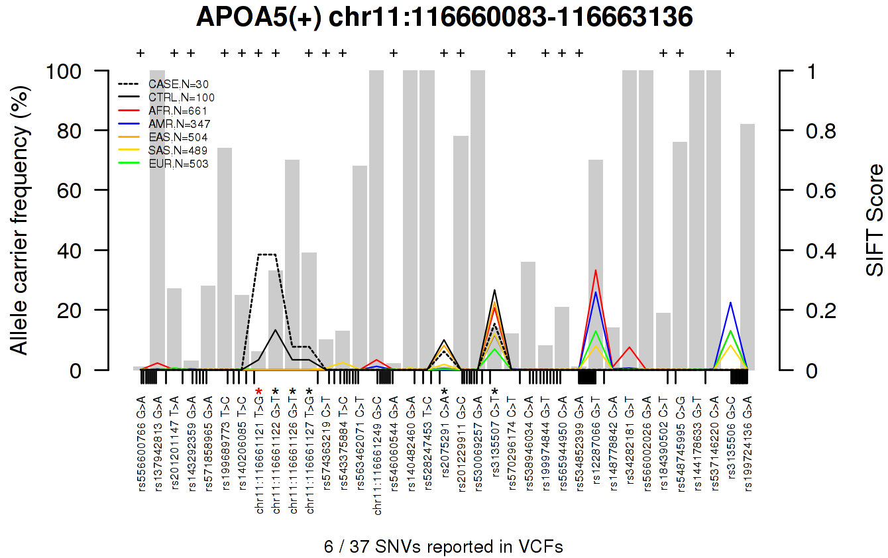
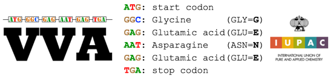

### About
 * VVA is a gene- and variant-centered visualization tool to be used for whole exome sequencing data analysis.
 * VVA is optimized for displaying the overall distribution of variants in a gene at a glance.
 
### Features
 * Gene- and variant-centered analysis for better interpretation
 * Displaying the overall distribution of variants in a gene at a glance
   i. variant deleteriousness score (i.e., Sorting Intolerant From Tolerant [SIFT])
   ii. variant frequency
   iii. the distances between the neighboring variants
   iv. highlight significant variant(s)
 * Gene characteristics (evolution): variability and conservation (i.e., Genomic Evolutionary Rate Profiling [GERP])
 * Inter-ethnic variability: the variant frequencies in public databases (i.e., The 1000 Genomes)
 * Confidence of variant: identification of likely false positive calls (i.e., SNP clusters)

### VVA results
 * How to interpret the plot?  
 [](http://public.lootpiz.com/VVA/CYP2D6_tip.png)
   * There are 108 variants reported in The 1000 Genomes Project (T1GP) that have SIFT scores in CYP2D6. Of the 108, five variants with an asterisk were reported in VCFs from user inputs. There was a significant variant (P<0.05) by Fisher's exact test (FET) at ➃, rs118203758 (chr22:42526669) with a red asterisk. This variant has a SIFT score of 0.01 which predicted to be deleterious and there were 6 (20%) carriers in 30 cases and 4 (4%) carriers in 100 controls, and only 6 (1.2%) EAS carriers weree observed, resulting in P=0.0323 by FET between case and control groups. The closest variant to 3' is rs536109057 (chr22:42526640), 29 bp away from ➃ so there are two ticks between the bars. The closest variant to 5' is rs373243894 (chr22:42526672), 3 bp away from ➃ so there is no tick between them. 
   
### Usage
 * Synopsis  
 ```./vva.py -a \<FILE\> -b \<FILE\> \[OPTIONS\]```
 * Required fields  
   -a, --casevcf 	\<FILE\>: input a case group in VCF that compressed by _bgzip_ and indexed by _tabix_  
   -b, --ctrlvcf 	\<FILE\>: input a control group in VCF that compressed by _bgzip_ and indexed by _tabix_  
 * Optional fields  
   -g, --gene 	\<STRING\>: target gene list in TXT or gene symbols with comma seperator otherwise all protein-coding genes  
   -c, --conservation 	\<STRING\>: show conservation \[TRUE or FALSE\], default is FALSE  
   -o, --output 	\<STRING\>: output directory name, default is "OUTPUT"  
   -n, --process 	\<NUMBER\>: number of processes to use, default is 4  

### Examples
    $ python vva.py -a case.vcf.gz -b ctrl.vcf.gz
    $ python vva.py -a case.vcf.gz -b ctrl.vcf.gz -c TRUE
    $ python vva.py -a case.vcf.gz -b ctrl.vcf.gz -g APOA5,CYP2D6
    $ python vva.py -a case.vcf.gz -b ctrl.vcf.gz -g target_genes.txt
    $ python vva.py -a case.vcf.gz -b ctrl.vcf.gz -g target_genes.txt -c TRUE -o results -n 32
    
    
### FAQ
 * What is input for VVA?
   * Input to VVA is Variant Call Format (VCF) files for case and control groups that contains multiple samples in each VCF.
   * Make sure that VCF should be compressed by bgzip and indexed by tabix.
 * How to combine multiple one-sample VCFs into a single VCF?
   * You can merge them via VCFTools and by typing the command below:
   ```$ vcf-merge A.vcf.gz B.vcf.gz C.vcf.gz | bgzip -c > out.vcf.gz```
 * How to identify likely false positive calls?  
   [](http://public.lootpiz.com/VVA/APOA5.html)  
   * You can find a significant variant at chr11:116661121. However, there are three neighboring variants within less than 10 bp. Four of them are not reported in The 1000 Genomes Project. These are likely false positive calls and you can check the status of aligned reads in BAM from an individual by clicking the plot.  
   
### What databases do you use?
 * HUGO protein-coding gene symbols, http://www.genenames.org/  
 * The 1000 Genomes Project, Phase 3, http://www.1000genomes.org/  
 * The Human Variation Databases for SIFT, http://sift.jcvi.org/  
 * Genomic Evolutionary Rate Profiling 2 (GERP++), http://www.sidowlab.org/
 
### What does the logo mean?
   
 "GENE"-centered, Variant Visualization and Annotation. 
 
   
